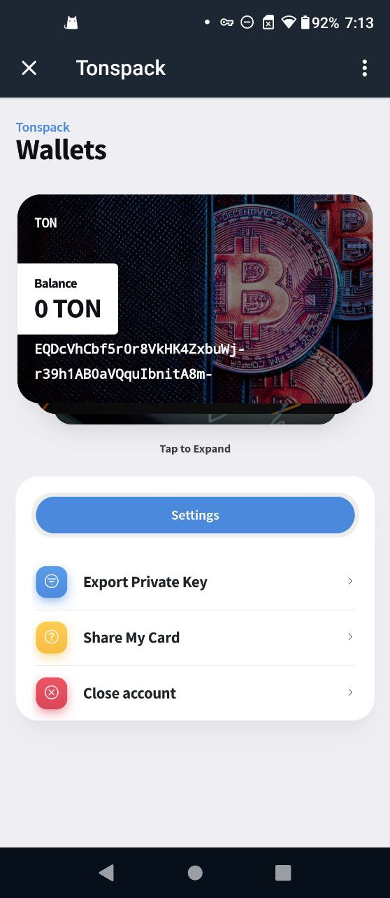
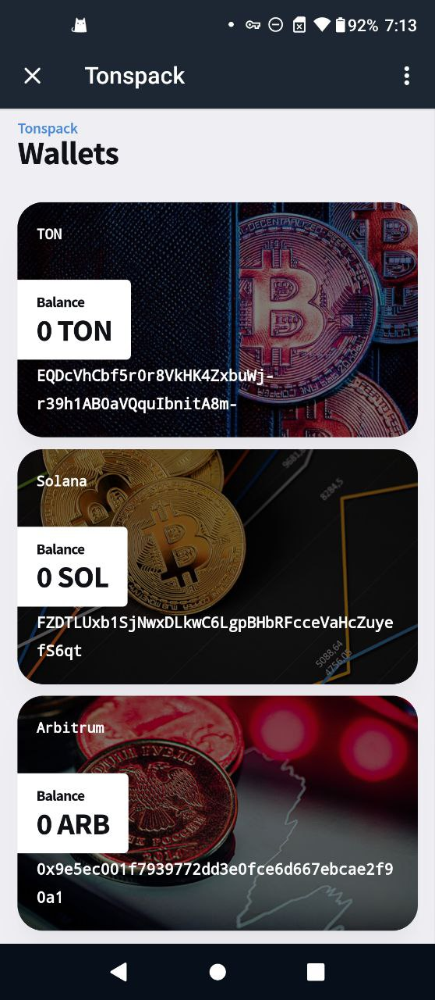

# 😇 Welcome

Tonspack is a multichains wallet base on Telegram webapp & bot , allows anyone to use telegram base crypto in most of the major chains .&#x20;

Currently Tonspack working in centralized way , using HD-wallet \[[BIP-44](https://github.com/bitcoin/bips/blob/master/bip-0044.mediawiki)] to generate unique keypair for telegram users .  And working with [litprotocol](https://www.litprotocol.com/) to rebuild it into fuilly **decentaliurzed** MPC wallet .

Now Tonspack also working on add wallet into **TonconnectUI / Walletconnect /wallet-adapter-react** . To make Tonspack into one of the major wallet .

## How tonspack work

Tonspack is working on build a mulity chains wallet by telegram webapp to allows users on mobile to connect easily .

And provide sdk/toolkit to help telegram webapp/minigame developer to join web3 easier .

#### Support functions :&#x20;

* Connect wallet&#x20;
  * Auto callup Tonspack-webapp confirm
  * Return wallet address
* Sign message
  * Auto callup Tonspack-webapp confirm
  * Return signed message and raw message and wallet address
* Sign and send tr
  * Auto callup Tonspack-webapp confirm
  * Return transaction status/hash

### Demo videos

[ https://youtube.com/shorts/jgyqbwG6vZ4?feature=share](https://youtube.com/shorts/jgyqbwG6vZ4?feature=share)

## Base screenshot&#x20;

<figure><figcaption></figcaption></figure>

 

<figure><figcaption></figcaption></figure>

<figure><figcaption></figcaption></figure>

 

<figure><figcaption></figcaption></figure>

